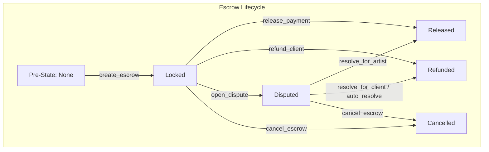

# StellarAid Smart Contract Events Reference

All Soroban smart contracts in the **StellarAid** ecosystem emit structured on-chain events for off-chain indexing, analytics, notifications, and client state synchronization.

Events are emitted using the Soroban host environment method:
```rust
env.events().publish(topics_tuple, payload_tuple);
```

---

## Table of Contents

1. [Architecture & Naming Conventions](#architecture--naming-conventions)
2. [Contract Event Catalogs](#contract-event-catalogs)
   - [1. Escrow Contract](#1-escrow-contract)
   - [2. Commission Agreement Contract](#2-commission-agreement-contract)
   - [3. Dispute Arbiter Contract](#3-dispute-arbiter-contract)
   - [4. Platform Configuration Contract](#4-platform-configuration-contract)
   - [5. Campaign Contract](#5-campaign-contract)
   - [6. Donation Contract](#6-donation-contract)
   - [7. Withdrawal Contract](#7-withdrawal-contract)
   - [8. Revenue Sharing Contract](#8-revenue-sharing-contract)
   - [9. Creator Fund Contract](#9-creator-fund-contract)
   - [10. Competitions Contract](#10-competitions-contract)
   - [11. Subscription Contract](#11-subscription-contract)
   - [12. Verification Contract](#12-verification-contract)
   - [13. Messaging Contract](#13-messaging-contract)
   - [14. Shared / Pause & Lookup Events](#14-shared--pause--lookup-events)
3. [Event Data Structures & Encoding](#event-data-structures--encoding)
4. [Emission Conditions & State Transitions Matrix](#emission-conditions--state-transitions-matrix)
5. [Event Subscription & Indexing Guide](#event-subscription--indexing-guide)
   - [Stellar RPC `getEvents` Filtering](#stellar-rpc-getevents-filtering)
   - [TypeScript Real-Time Ingestion Loop](#typescript-real-time-ingestion-loop)
   - [Re-org Resilience & Idempotency](#re-org-resilience--idempotency)
6. [Ordering Guarantees & Consistency Models](#ordering-guarantees--consistency-models)

---

## Architecture & Naming Conventions

StellarAid enforces a **standardized two-topic tuple hierarchy**:

```
topics: ( Symbol("<contract_domain>"), Symbol("<action_name>") )
```

* **Topic 0 (Domain):** Identifies the smart contract subsystem (e.g., `escrow`, `agr`, `dispute`, `config`, `camp`, `dnt`).
* **Topic 1 (Action):** Identifies the state transition or operation (e.g., `created`, `released`, `refunded`, `opened`, `approved`).
* **Payload:** A typed tuple or single ScVal containing event parameters in deterministic order.

**Correlated events (correlation IDs, #661):** events that should be correlated
across contracts (e.g. a `create_escrow` that mirrors a commission agreement)
carry a third reserved topic `Symbol("corr")` plus the derived 32-byte
`CorrelationId` in the payload. Consumers place them under the same "corr" group;

```
topics: ( Symbol("<contract_domain>"), Symbol("<action_name>"), Symbol("corr") )
payload: ( ..., correlation_id: BytesN<32> )
```

Segregating correlation events behind the reserved `corr` topic keeps them
distinct from plain two-topic events (`escrow`/`created`, etc.) in RPC filters
and avoids false matches against token `transfer` events, which also emit three
topics but with `Address` payloads in topic positions 1/2. See
[Correlation Events (Escrow)](#correlation-events-escrow) for the concrete schema.

```rust
// Example: Escrow Created Event
env.events().publish(
    (symbol_short!("escrow"), symbol_short!("created")),
    (commission_id, client, artist, amount_stroops, fee_bps),
);
```

---

## Contract Event Catalogs

### 1. Escrow Contract

Emitted by `contracts/escrow` during payment custody lifecycle.

#### `escrow` / `created`
* **Trigger:** `create_escrow`
* **Condition:** Successful lock of client token funds into escrow storage.
* **Payload:**

| Field | Type | Description |
|---|---|---|
| `commission_id` | `Bytes` | Unique commission identifier |
| `client` | `Address` | Client payer address |
| `artist` | `Address` | Artist payee address |
| `amount` | `i128` | Total locked token amount (in stroops) |
| `fee_bps` | `u32` | Platform fee in basis points (e.g. 500 = 5%) |

#### `escrow` / `released`
* **Trigger:** `release_payment`
* **Condition:** Client authorizes full release of funds to artist; net payout and fee transfers succeed.
* **Payload:**

| Field | Type | Description |
|---|---|---|
| `commission_id` | `Bytes` | Unique commission identifier |
| `artist` | `Address` | Artist recipient address |
| `net_amount` | `i128` | Net funds transferred to artist |
| `fee_amount` | `i128` | Platform fee transferred to platform wallet |

#### `escrow` / `refunded`
* **Trigger:** `refund_client`
* **Condition:** Escrow is cancelled, expired, or decided in client's favor via dispute arbitration.
* **Payload:**

| Field | Type | Description |
|---|---|---|
| `commission_id` | `Bytes` | Unique commission identifier |
| `client` | `Address` | Payer receiving refund |
| `amount` | `i128` | Total refunded amount |

#### `escrow` / `disputed`
* **Trigger:** `open_dispute`
* **Condition:** Client, artist, or dispute arbiter flags escrow for investigation.
* **Payload:**

| Field | Type | Description |
|---|---|---|
| `commission_id` | `Bytes` | Unique commission identifier |
| `initiator` | `Address` | Address opening the dispute |

#### `escrow` / `expired`
* **Trigger:** `check_and_expire` or automated sweep
* **Condition:** Ledger sequence exceeds expiration ledger without resolution.
* **Payload:**

| Field | Type | Description |
|---|---|---|
| `commission_id` | `Bytes` | Unique commission identifier |
| `expiry_ledger` | `u32` | Ledger sequence at expiration |

#### `escrow` / `cancelled`
* **Trigger:** `cancel_escrow`
* **Condition:** Agreement cancellation policy executed with pro-rata split.
* **Payload:**

| Field | Type | Description |
|---|---|---|
| `commission_id` | `Bytes` | Unique commission identifier |
| `client_amount` | `i128` | Amount returned to client |
| `artist_amount` | `i128` | Amount paid to artist |

#### Correlation Events (Escrow)

Cross-contract correlation points emitted by `contracts/escrow` (from
`contracts/shared`'s `correlation` module, #661) always use the reserved
`corr` topic.

##### `escrow` / `created` / `corr`
* **Trigger:** `create_escrow`
* **Condition:** Successful lock of client token funds into escrow storage.
* **Topics:** `(escrow, created, corr)`
* **Payload:**

| Field | Type | Description |
|---|---|---|
| `correlation_id` | `BytesN<32>` | Deterministically derived SHA-256 correlation id (#661) |
| `key` | `Bytes` | Shared operation key (the `commission_id`) enabling cross-contract joins |

##### `escrow` / `released` / `corr` (planned)
* **Trigger:** `release_payment`
* **Condition:** Released escrows carrying a correlation id also emit the
  3-topic correlated variant with the same `correlation_id` in the payload.

> **Indexing note:** correlation events are distinct from the two-topic events
> listed above. Filter on topic `corr` (position 2) — many contracts also emit
> three-topic events where topic positions 1/2 are `Address` values (e.g. token
> `transfer`), so a filter that only checks "length == 3" will produce false
> positives; always compare topic 2 to the `corr` symbol.

---

### 2. Commission Agreement Contract

Emitted by `contracts/commission_agreement` during agreement negotiations and milestone progress.

#### `agr` / `created`
* **Trigger:** `create_agreement`
* **Payload:** `(commission_id: Bytes, client: Address, artist: Address, budget_usdc: i128, deadline: u32)`

#### `agr_ok` / `(none)` (`symbol_short!("agr_ok")`)
* **Trigger:** `accept_agreement`
* **Payload:** `(commission_id: Bytes)`

#### `agr_rej` / `(none)` (`symbol_short!("agr_rej")`)
* **Trigger:** `reject_agreement`
* **Payload:** `(commission_id: Bytes, reason: String)`

#### `ms_new` / `(none)` (`symbol_short!("ms_new")`)
* **Trigger:** `propose_milestone`
* **Payload:** `(commission_id: Bytes, milestone_id: Bytes, amount_usdc: i128)`

#### `ms_approved` / `(none)` (`Symbol::new("ms_approved")`)
* **Trigger:** `approve_milestone`
* **Payload:** `(commission_id: Bytes, milestone_id: Bytes)`

#### `canc_pol` / `(none)` (`symbol_short!("canc_pol")`)
* **Trigger:** `set_cancellation_policy`
* **Payload:** `(commission_id: Bytes, penalty_bps: u32, grace_ledgers: u32)`

---

### 3. Dispute Arbiter Contract

Emitted by `contracts/dispute_arbiter` during dispute resolution.

#### `dispute` / `opened`
* **Trigger:** `open_dispute`
* **Payload:** `(commission_id: Bytes, initiator: Address, opened_ledger: u32, auto_resolve_ledger: u32)`

#### `dispute` / `resolved`
* **Trigger:** `resolve_for_client`, `resolve_for_artist`, or `partial_resolve`
* **Payload:** `(commission_id: Bytes, status: DisputeStatus, client_share_bps: u32, note: String)`

#### `dispute` / `auto_resolved`
* **Trigger:** `auto_resolve`
* **Payload:** `(commission_id: Bytes, resolved_at_ledger: u32)`

#### `dispute` / `init`
* **Trigger:** `initialize`
* **Payload:** `(admin: Address, escrow: Address, config: Address, auto_resolve_ledgers: u32)`

---

### 4. Platform Configuration Contract

Emitted by `contracts/platform_config`.

#### `config_initialized`
* **Trigger:** `initialize`
* **Payload:** `(admin: Address, fee_bps: u32, platform_wallet: Address, usdc_token: Address)`

#### `fee_bps_updated`
* **Trigger:** `set_fee_bps`
* **Payload:** `(old_fee_bps: u32, new_fee_bps: u32)`

#### `admin_transfer_initiated`
* **Trigger:** `transfer_admin`
* **Payload:** `(current_admin: Address, pending_admin: Address)`

#### `admin_transfer_completed`
* **Trigger:** `accept_admin`
* **Payload:** `(old_admin: Address, new_admin: Address)`

#### `addrreg` / `(name)` (`symbol_short!("addrreg")`)
* **Trigger:** `register_address`
* **Condition:** A dependency for `environment`+`name` was registered (PR #662).
* **Topics:** `(addrreg, <name>)`
* **Payload:** `(environment: AddressEnvironment, address: Address)`
* **Note:** `AddressEnvironment` is one of `Production` / `Test`, enabling a
  per-environment dependency registry resolved through `resolve_for_environment`
  with a bounded `ResolutionCache` (TTL `86_400` ledgers).

---

### 5. Campaign Contract

Emitted by `contracts/campaign`. See
[Campaign Event Schema Reference](#campaign-event-schema-reference) for the
normative catalogue of topics, data fields and emission points; the list below
is the legacy short form.

* `campaign_registered`: `(campaign_id: u64, owner: Address, goal: i128, deadline: u64)`
* `campaign_status_changed`: `(campaign_id: u64, old_status: CampaignStatus, new_status: CampaignStatus)`
* `campaign_archived`: `(campaign_id: u64)`
* `contract_frozen` / `contract_unfrozen`: `(admin: Address)`
* `flag_for_review`: `(admin: Address, reason_hash: BytesN<32>)`
* `clear_review_flag`: `(admin: Address)`
* `admin_changed`: `(old_admin: Address, new_admin: Address)`

---

### 6. Donation Contract

Emitted by `contracts/donation`.

* `donation_made`: `(donor: Address, campaign_id: u64, amount: i128)`
* `donation_refunded`: `(campaign_id: u64, donor: Address, amount: i128, caller: Address)`
* `anonymous_donation`: `(campaign_id: u64, amount: i128)`

The campaign-side `donation_received` event is emitted by
`contracts/campaign::record_donation`, which this contract calls after the
donor's token transfer has settled. See
[`donation_received`](#donation_received).

---

### 7. Withdrawal Contract

Emitted by `contracts/withdrawal`.

* `withdrawal_requested`: `(withdrawal_id: u64, campaign_id: u64, recipient: Address, amount: i128)`
* `withdrawal_approved`: `(withdrawal_id: u64, tx_hash: BytesN<32>)`
* `withdrawal_rejected`: `(withdrawal_id: u64, reason: String)`

The campaign-side withdrawal lifecycle (`withdrawal_requested`,
`withdrawal_finalized`, `withdrawal_cancelled`) is emitted by
`contracts/campaign` — see
[Campaign Event Schema Reference](#campaign-event-schema-reference).

---

## Campaign Event Schema Reference

This section is the normative reference for campaign-side events and fulfils
the "define all contract event schemas" requirement: every event below states
its **topics**, its **data fields**, and **when it is emitted**.

### Naming convention

Every campaign-side event uses:

```text
<entity>_<past_tense_verb>        // snake_case, e.g. withdrawal_finalized
```

* `<entity>` is one of `campaign`, `donation`, `withdrawal`, `dispute`, `refund`.
* The verb is always past tense and always the **last** segment, so an indexer
  can group a single entity's lifecycle by a stable prefix.

The convention carries through to the `#[contracttype]` payload structs in
`contracts/campaign/src/events.rs`: the struct name is the event name in
`PascalCase` with an `Event` suffix (`withdrawal_finalized` →
`WithdrawalFinalizedEvent`).

### Topic layout

```text
topics: ( Symbol("<event_name>"), Address /* emitting contract */ )
data:   <EventStruct>   // #[contracttype]; the field order below is the wire order
```

* **Topic 0** is the event name, so a Horizon/RPC `getEvents` filter can select
  a single event by symbol alone.
* **Topic 1** is the emitting contract address, so a relayed event (the donation
  contract forwarding into the campaign contract) stays attributable.

Both segments are mandatory. A single-event RPC filter looks like:

```json
{
  "type": "contract",
  "contractId": "<CAMPAIGN_CONTRACT_ID>",
  "topics": [["donation_received", "A"]]
}
```

`"A"` is the any-value wildcard. Do **not** assume a three-topic shape for these
events: token `transfer` events also carry three topics, which is precisely why
the campaign schema is pinned at two.

### Catalogue

#### `campaign_initialized`
* **Topics:** `["campaign_initialized", contract_address]`
* **Emitted by:** `initialize`, after `Admin` / `Initialized` / `CampaignCount`
  have been written. Once per deployment.
* **Data:**

| Field | Type | Description |
|---|---|---|
| `admin` | `Address` | Admin stored at initialization; the only address that can `upgrade` |
| `version` | `String` | Crate semver seeded into the version store |
| `timestamp` | `u64` | Ledger timestamp of initialization |

#### `campaign_registered`
* **Topics:** `["campaign_registered", contract_address]` *(currently single-topic on chain; see note below)*
* **Emitted by:** `create_campaign`, after the `Campaign` record is persisted and
  its TTL extended.
* **Data:** `(campaign_id: u64, owner: Address, goal: i128, deadline: u64)`

#### `donation_received`
* **Topics:** `["donation_received", contract_address]`
* **Emitted by:** `record_donation`, **after** a successful token transfer *and*
  after the campaign's `raised` total has been updated in storage. The donation
  contract calls it cross-contract, so the amount always matches an on-chain
  token movement.
* **Data:**

| Field | Type | Description |
|---|---|---|
| `campaign_id` | `u64` | Campaign credited (carried in the data, not as a third topic) |
| `donor` | `Address` | Donor address; an ephemeral address for anonymous donations |
| `amount` | `i128` | Amount received, in the asset's base unit |
| `asset_code` | `String` | Human-readable asset code, at most 12 characters (e.g. `USDC`) |
| `raised_total` | `i128` | Campaign `raised` **after** this donation — a running total, not a delta |
| `timestamp` | `u64` | Ledger timestamp of the donation |

#### `withdrawal_requested`
* **Topics:** `["withdrawal_requested", contract_address]`
* **Emitted by:** `request_withdrawal`, after the `PendingWithdrawal` record is
  written. Creator-only. This event only *schedules* funds; it never implies a
  transfer.
* **Data:**

| Field | Type | Description |
|---|---|---|
| `campaign_id` | `u64` | Campaign the request belongs to |
| `amount` | `i128` | Amount requested, in the campaign's base unit |
| `requested_at` | `u32` | Ledger sequence at which the request was made |
| `available_at` | `u32` | Earliest ledger sequence at which `finalize_withdrawal` may run (`requested_at + withdrawal_delay_ledgers`) |

#### `withdrawal_finalized`
* **Topics:** `["withdrawal_finalized", contract_address]`
* **Emitted by:** `finalize_withdrawal`, after `raised` has been debited and the
  running `TotalWithdrawn` updated. Emitted **separately** from
  `withdrawal_requested`; consumers must treat the pair as a state machine
  rather than a single notification. Suppressed while the contract is frozen,
  paused, or under fraud review.
* **Data:**

| Field | Type | Description |
|---|---|---|
| `campaign_id` | `u64` | Campaign the funds were drawn from |
| `amount` | `i128` | Gross amount deducted from `raised` |
| `fee` | `i128` | Platform fee entitlement on `amount` (`amount * fee_bps / 10_000`) |
| `recipient` | `Address` | Campaign owner; funds may only ever be drawn to the creator |
| `timestamp` | `u64` | Ledger timestamp of finalization |

#### `withdrawal_cancelled`
* **Topics:** `["withdrawal_cancelled", contract_address]`
* **Emitted by:** `cancel_withdrawal_request`, after the pending request has been
  removed from storage. Creator-only.
* **Data:**

| Field | Type | Description |
|---|---|---|
| `campaign_id` | `u64` | Campaign whose request was cancelled |
| `amount` | `i128` | Amount of the cancelled request |
| `cancelled_at` | `u32` | Ledger sequence at which it was cancelled |

#### `dispute_raised`
* **Topics:** `["dispute_raised", contract_address]`
* **Emitted by:** `raise_dispute`, after the open-dispute marker and the reason
  hash are written. Authorized to the campaign creator or to a donor of that
  campaign. Refused with `DisputeAlreadyOpen` when one is already open.
* **Data:**

| Field | Type | Description |
|---|---|---|
| `campaign_id` | `u64` | Disputed campaign |
| `raised_by` | `Address` | Creator or donor that raised the dispute |
| `reason_hash` | `BytesN<32>` | SHA-256 of the reason text; the text itself is never stored on chain |
| `raised_at` | `u64` | Ledger timestamp of the dispute |

#### `dispute_resolved`
* **Topics:** `["dispute_resolved", contract_address]`
* **Emitted by:** `resolve_dispute`. Admin-only. Refused with `NoActiveDispute`
  when no dispute is open.
* **Data:**

| Field | Type | Description |
|---|---|---|
| `campaign_id` | `u64` | Disputed campaign |
| `outcome` | `bool` | `true` = the disputed withdrawal is **allowed**; `false` = **blocked** |
| `resolved_at` | `u64` | Ledger timestamp of resolution |

#### `refund_issued`
* **Topics:** `["refund_issued", contract_address]`
* **Emitted by:** `request_refund`, after the donor's running refund total has
  been updated. Only accepted once the campaign is no longer `Active`.
* **Data:**

| Field | Type | Description |
|---|---|---|
| `campaign_id` | `u64` | Campaign refunded from |
| `donor` | `Address` | Donor entitled to the refund |
| `amount` | `i128` | Amount credited to the donor in this call |
| `timestamp` | `u64` | Ledger timestamp |

#### `campaign_ended`
* **Topics:** `["campaign_ended", contract_address]`
* **Emitted by:** `end_campaign`, after the status becomes `Completed`.
  Creator- or admin-authorized.
* **Data:**

| Field | Type | Description |
|---|---|---|
| `campaign_id` | `u64` | Campaign that ended |
| `raised` | `i128` | Total raised at close |
| `goal` | `i128` | Original goal |
| `ended_at` | `u64` | Ledger timestamp of the transition |

#### `campaign_cancelled`
* **Topics:** `["campaign_cancelled", contract_address]`
* **Emitted by:** `cancel_campaign`, after the status becomes `Cancelled`.
  Creator- or admin-authorized. Refused with `CannotCancelWithFunds` while
  `raised > 0`, so a cancellation can never strand donor funds.
* **Data:**

| Field | Type | Description |
|---|---|---|
| `campaign_id` | `u64` | Campaign that was cancelled |
| `cancelled_by` | `Address` | Creator or admin that cancelled it |
| `reason_hash` | `BytesN<32>` | SHA-256 of the cancellation reason |
| `cancelled_at` | `u64` | Ledger timestamp of the transition |

#### `deadline_extended`
* **Topics:** `["deadline_extended", contract_address]`
* **Emitted by:** `extend_deadline`, after the new deadline is persisted.
  Creator-only. The new deadline must be later than the current one, the
  campaign must be `Active`, and the 2-year ceiling from `create_campaign` still
  applies. Carrying both the old and the new value means a reminder job never
  has to diff two reads.
* **Data:**

| Field | Type | Description |
|---|---|---|
| `campaign_id` | `u64` | Campaign whose deadline moved |
| `old_deadline` | `u64` | Previous deadline (ledger timestamp) |
| `new_deadline` | `u64` | New deadline (ledger timestamp) |
| `extended_at` | `u64` | Ledger timestamp of the extension |

### Emission matrix

| Event | Emitting function | Pre-condition | Post-condition | Authorization |
|---|---|---|---|---|
| `campaign_initialized` | `initialize` | not yet initialized | `Admin`, `Initialized`, `CampaignCount` set | `admin.require_auth()` |
| `campaign_registered` | `create_campaign` | deadline in (now, now + 2y]; `fee_bps <= 1000` | `Campaign(id)` persisted, TTL extended | `owner.require_auth()` |
| `donation_received` | `record_donation` | `amount > 0`; campaign exists | `raised += amount`; donor marker set | called by the donation contract after the transfer settles |
| `withdrawal_requested` | `request_withdrawal` | `0 < amount <= raised`; no pending request | `PendingWithdrawal(id)` persisted | creator (`campaign.owner`) |
| `withdrawal_finalized` | `finalize_withdrawal` | `0 < amount <= raised`; window elapsed; not frozen/paused/under review | `raised -= amount`; `TotalWithdrawn += amount` | creator (`campaign.owner`) |
| `withdrawal_cancelled` | `cancel_withdrawal_request` | a pending request exists | `PendingWithdrawal(id)` removed | creator |
| `dispute_raised` | `raise_dispute` | no open dispute; `reason_hash != 0` | `ActiveDispute(id) = true`; reason hash stored | creator **or** donor |
| `dispute_resolved` | `resolve_dispute` | a dispute is open | `ActiveDispute(id) = false`; outcome stored | admin |
| `refund_issued` | `request_refund` | campaign is not `Active`; `amount > 0` | `Refunded(id, donor) += amount` | donor |
| `campaign_ended` | `end_campaign` | campaign not already closed | status = `Completed` | creator **or** admin |
| `campaign_cancelled` | `cancel_campaign` | `raised == 0`; not already cancelled | status = `Cancelled` | creator **or** admin |
| `deadline_extended` | `extend_deadline` | `Active`; new deadline later and within 2y | `deadline` updated | creator |

Pre-existing single-topic events in this contract (`campaign_registered`,
`campaign_status_changed`, `campaign_archived`, `contract_frozen`,
`contract_unfrozen`, `flag_for_review`, `clear_review_flag`, `admin_changed`)
keep their historical single-topic shape for backwards compatibility with
existing indexers. New events must use the two-segment layout above.

---

### 8. Revenue Sharing Contract

Emitted by `contracts/revenue_sharing`.

* `agreement_created`: `(agreement_id: Bytes, creator: Address, total_bps: u32)`
* `revenue_distributed`: `(agreement_id: Bytes, total_amount: i128, participant_count: u32)`
* `agreement_paused`: `(agreement_id: Bytes)`
* `agreement_terminated`: `(agreement_id: Bytes)`

---

### 9. Creator Fund Contract

Emitted by `contracts/creator_fund`.

* `fund_created`: `(fund_id: Bytes, steward: Address, fund_type: FundType)`
* `proposal_submitted`: `(proposal_id: Bytes, recipient: Address, amount: i128)`
* `proposal_voted`: `(proposal_id: Bytes, voter: Address, support: bool, weight: i128)`
* `proposal_executed`: `(proposal_id: Bytes, amount: i128)`

---

### 10. Competitions Contract

Emitted by `contracts/competitions`.

* `comp_created`: `(competition_id: Bytes, organizer: Address, prize_pool: i128)`
* `submission_made`: `(competition_id: Bytes, participant: Address, uri: String)`
* `comp_finalized`: `(competition_id: Bytes, winner_count: u32)`
* `prizes_distributed`: `(competition_id: Bytes, total_paid: i128)`

---

### 11. Subscription Contract

Emitted by `contracts/subscription`.

* `tier_created`: `(tier_id: u32, price_stroops: i128, period_ledgers: u32)`
* `subscribed`: `(subscriber: Address, tier_id: u32, end_ledger: u32)`
* `renewed`: `(subscriber: Address, tier_id: u32, new_end_ledger: u32)`
* `cancelled`: `(subscriber: Address, tier_id: u32)`
* `lapsed`: `(subscriber: Address, tier_id: u32)`

---

### 12. Verification Contract

Emitted by `contracts/verification`.

* `request_submitted`: `(artist: Address, work_count: u32)`
* `reviewed`: `(artist: Address, reviewer: Address, score: u32)`
* `approved`: `(artist: Address, final_score: u32)`
* `stale_flagged`: `(artist: Address, last_update_ledger: u32)`

---

### 13. Messaging Contract

Emitted by `contracts/messaging`.

* `convo_created`: `(convo_id: Bytes, participant1: Address, participant2: Address)`
* `msg_sent`: `(convo_id: Bytes, sender: Address, timestamp: u64)`
* `msg_read`: `(convo_id: Bytes, reader: Address, last_read_idx: u32)`
* `typing_set`: `(convo_id: Bytes, user: Address, is_typing: bool)`

---

### 14. Shared / Pause & Lookup Events

Emitted by all contracts inheriting `contracts/shared`.

* `contract_paused`: `(admin: Address)`
* `contract_unpaused`: `(admin: Address)`
* `cfg_fail`: `(config_contract: Address, selector: Symbol)`

---

## Emission Conditions & State Transitions Matrix



| Event | Pre-condition | Post-condition | Authorization Required |
|---|---|---|---|
| `(escrow, created)` | Escrow key does not exist; client balance >= amount | Escrow state = `Locked`; tokens transferred to contract | `client.require_auth()` |
| `(escrow, released)` | Escrow state = `Locked` or `Disputed` | Escrow state = `Released`; tokens sent to artist & fee wallet | `client.require_auth()` or `arbiter` |
| `(escrow, refunded)` | Escrow state = `Locked`, `Disputed`, or `Expired` | Escrow state = `Refunded`; tokens returned to client | `client.require_auth()` or `arbiter` |
| `(escrow, disputed)` | Escrow state = `Locked` | Escrow state = `Disputed` | `initiator.require_auth()` |
| `(escrow, cancelled)` | Escrow state = `Locked` or `Disputed`; cancellation policy satisfied | Escrow state = `Cancelled`; pro-rata split distributed | `client.require_auth()` |

---

## Event Subscription & Indexing Guide

### Stellar RPC `getEvents` Filtering

Soroban RPC servers provide a `getEvents` endpoint supporting topic-based filtering and ledger pagination.

```typescript
import { rpc } from '@stellar/stellar-sdk';

const server = new rpc.Server('https://soroban-testnet.stellar.org');

// Example: Filter for all escrow events
const eventsResponse = await server.getEvents({
  startLedger: 100000,
  filters: [
    {
      type: 'contract',
      contractIds: ['CAAAAAAAAAAAAAAAAAAAAAAAAAAAAAAAAAAAAAAAAAAAAAAAAAAAMDR4'],
      topics: [
        // Match topic 0 = "escrow", topic 1 = any
        ['escrow', '*']
      ],
    }
  ],
  limit: 100,
});
```

### TypeScript Real-Time Ingestion Loop

```typescript
import { rpc, scValToNative } from '@stellar/stellar-sdk';

export async function startIndexer(
  rpcUrl: string,
  contractId: string,
  onEvent: (event: any) => Promise<void>
) {
  const server = new rpc.Server(rpcUrl);
  let cursor: string | undefined = undefined;

  console.log(`[Indexer] Starting event ingestion for ${contractId}...`);

  while (true) {
    try {
      const response = await server.getEvents({
        cursor,
        filters: [{ type: 'contract', contractIds: [contractId] }],
        limit: 50,
      });

      for (const rawEvent of response.events) {
        const topics = rawEvent.topic.map(t => scValToNative(t));
        const value = scValToNative(rawEvent.value);

        await onEvent({
          id: rawEvent.id,
          ledger: rawEvent.ledger,
          ledgerClosedAt: rawEvent.ledgerClosedAt,
          topics,
          payload: value,
        });

        cursor = rawEvent.pagingToken;
      }
    } catch (err) {
      console.error('[Indexer] RPC Error in event polling, backing off...', err);
      await new Promise(r => setTimeout(r, 5000));
    }

    await new Promise(r => setTimeout(r, 2000));
  }
}
```

### Re-org Resilience & Idempotency

1. **Unique Event Primary Key:** Always use `${event.ledger}_${event.txHash}_${event.eventIndex}` as the deduplication key in relational databases.
2. **Transaction Atomicity:** Ingest events within database transactions corresponding to ledger sequence blocks.
3. **Rollback Handling:** If the RPC reports a ledger re-organization, purge unfinalized events for ledger >= `reorg_start_ledger` before replaying.

---

## Ordering Guarantees & Consistency Models

Stellar Soroban guarantees **total causal event ordering**:

1. **Ledger Sequence Number:** Ledgers close deterministically strictly sequentially ($L_1 < L_2 < L_3$).
2. **Transaction Execution Order:** Within ledger $L_n$, transactions are applied strictly sequentially according to their transaction envelope order.
3. **Intra-Transaction Emission Order:** Within a single transaction execution (including cross-contract calls), events are appended in exact chronological order of `env.events().publish()` invocations.
4. **Finality:** Stellar Consensus Protocol (SCP) achieves instant deterministic finality at ledger close (no probabilistic forks like PoW/Nakamoto consensus).
